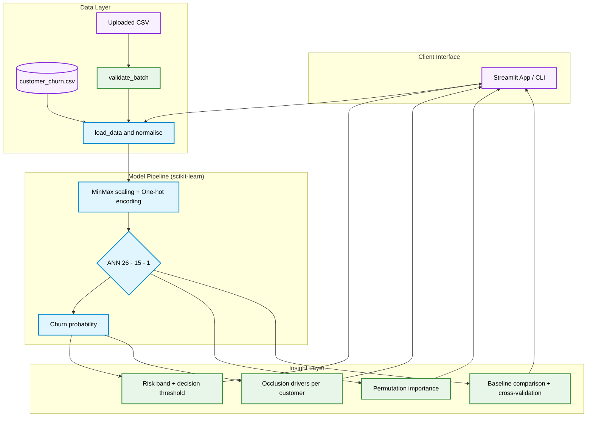

<div align="center">

# Customer Churn Prediction

**An interactive telecom churn predictor: an ANN classifier with per-customer explanations, batch scoring and model diagnostics, served through Streamlit.**

[](https://www.python.org/)
[](https://streamlit.io/)
[](https://scikit-learn.org/)
[](https://pandas.pydata.org/)
[](https://altair-viz.github.io/)
[](https://docs.pytest.org/)

</div>

---

## Overview

Customer churn is the rate at which customers leave a business. This project trains a feed-forward neural network on 7,043 telecom customers (about 27% churn) and wraps it in a Streamlit app: score a single customer and see what drives the prediction, score a whole CSV, explore the data, and inspect how well the model really performs.

---

## Architecture Overview



---

## Features

| Component                     | Description                                                                                                                                                |
| ----------------------------- | ---------------------------------------------------------------------------------------------------------------------------------------------------------- |
| **Single-Customer Predictor** | Interactive form with presets; shows churn probability, risk band, the stay/churn decision and the top factors raising or lowering the risk.               |
| **Batch Scoring**             | Upload a CSV, get validated and scored results with a probability histogram, risk-band filters and a downloadable scored file.                             |
| **Adjustable Threshold**      | One sidebar slider moves the decision threshold everywhere, making the precision / recall trade-off tangible.                                              |
| **Data Explorer**             | Churn rate by category and overlaid distributions of tenure and charges for churned versus retained customers.                                             |
| **Model Diagnostics**         | Confusion matrix, ROC curve, threshold sweep, permutation importance, baseline comparison and 5-fold cross-validation.                                     |
| **Honest Evaluation**         | Stratified split, scaler fitted on training data only, early stopping on an internal validation set, and accuracy shown against a majority-class baseline. |
| **Robust Inputs**             | Upload validation with clear errors, unfamiliar categories tolerated, blank `TotalCharges` handled.                                                        |

---

## Technology Stack

| Component            | Technologies                                         |
| :------------------- | :--------------------------------------------------- |
| **Modeling**         | `scikit-learn` (`MLPClassifier`, pipelines, metrics) |
| **Data Handling**    | `Pandas`, `NumPy`                                    |
| **Frontend UI**      | `Streamlit`                                          |
| **Visualisation**    | `Altair`                                             |
| **Testing**          | `Pytest`, Streamlit `AppTest`                        |
| **Quality & CI**     | `Ruff`, GitHub Actions                               |
| **Containerization** | `Docker`, Dev Containers                             |

---

## Project Structure

```text
Customer-Churn-Prediction/
├── app.py                      # Streamlit application
├── churn/
│   ├── __init__.py             # App name and version
│   ├── __main__.py             # python -m churn entry point
│   ├── charts.py               # Altair chart builders
│   ├── cli.py                  # train / evaluate / predict commands
│   ├── config.py               # Paths, column groups, model settings
│   ├── data.py                 # Loading, cleaning, encoding, upload validation
│   ├── explain.py              # Per-customer occlusion drivers
│   └── model.py                # Pipeline, training, metrics, scoring
├── data/
│   ├── customer_churn.csv      # 7,043 customers
│   └── sample_customers.csv    # 200 unlabeled rows for the batch demo
├── tests/
│   ├── conftest.py
│   ├── test_data.py            # Cleaning, encoding, label regression, validation
│   ├── test_model.py           # Quality, leakage, determinism, metrics, scoring
│   ├── test_explain_charts_cli.py
│   ├── test_notebook.py        # Guards against the original label bug
│   └── test_app.py             # Streamlit AppTest scenarios
├── .devcontainer/
│   └── devcontainer.json       # GitHub Codespaces / VS Code dev container
├── .github/workflows/ci.yml    # Lint + tests on push
├── .streamlit/config.toml      # Server and theme settings
├── .dockerignore
├── .gitignore
├── Dockerfile                  # Container image (runs as non-root)
├── LICENSE                     # MIT
├── Makefile                    # Developer commands (install, test, lint)
├── .pre-commit-config.yaml     # Git hooks for code formatting
├── pyproject.toml              # Project metadata and tooling
└── requirements.txt            # Runtime dependencies
```

---

## Setup & Execution

### 1. Environment Initialization

```bash
git clone https://github.com/Shashank17singh/Customer-Churn-Prediction
cd Customer-Churn-Prediction
python -m venv .venv
source .venv/bin/activate        # Windows: .venv\Scripts\activate
pip install -r requirements.txt
```

No API keys are needed. The model trains in a few seconds when the app starts.

### 2. Run the Streamlit App

```bash
streamlit run app.py
```

### 3. Use the Command Line

```bash
python -m churn train                                    # train, print test metrics, save models/churn_model.joblib
python -m churn evaluate                                 # baselines, threshold trade-off, feature importance
python -m churn predict data/sample_customers.csv        # score a CSV -> scored_customers.csv
```

### 4. Batch File Format

Your CSV needs the 19 feature columns of the training data (`customerID` is optional, `Churn` is optional and only used to measure accuracy). Use the **Download template** button in the app or `data/sample_customers.csv` as a reference.

### 5. Run Tests and Quality Checks

```bash
make install      # Installs the app and all dev dependencies (pytest, ruff, mypy)
make lint         # Runs Ruff and checks formatting
make typecheck    # Runs MyPy to verify types
make test         # Runs the Pytest suite with coverage
```

---

## Model Results

Evaluated on a stratified 20% hold-out set (1,409 customers) at the default 0.5 threshold:

| Model               | ROC-AUC | Precision | Recall | F1    | Accuracy |
| ------------------- | ------- | --------- | ------ | ----- | -------- |
| **ANN (26-15-1)**   | 0.832   | 0.617     | 0.492  | 0.548 | 0.784    |
| Logistic regression | 0.841   | 0.642     | 0.551  | 0.593 | 0.799    |
| Random forest       | 0.841   | 0.648     | 0.516  | 0.574 | 0.797    |
| Gradient boosting   | 0.834   | 0.642     | 0.545  | 0.590 | 0.798    |

Five-fold cross-validation of the ANN: ROC-AUC 0.839 ± 0.015, recall 0.539 ± 0.034.

How to read this:

- Always predicting "no churn" already scores **73.5% accuracy**, so accuracy alone is a weak yardstick. Look at recall and precision for churners.
- At 0.5 the ANN catches about half of the churners. Lowering the threshold to 0.3 raises recall to 72% at 53% precision; pick the point that matches your retention budget.
- A plain logistic regression matches or beats the ANN on this tabular data. The ANN is kept because it mirrors the original project; for production, the simpler model is a reasonable choice.
- The strongest signals are contract type, internet service and tenure: month-to-month, fiber-optic and newer customers churn most.

---

## Deployment

### 1. Push to GitHub

```bash
git init
git add .
git commit -m "Initial commit: Customer Churn Prediction"
git branch -M main
git remote add origin https://github.com/shashank17singh/Customer-Churn-Prediction.git
git push -u origin main
```

### 2. Deploy on Streamlit Community Cloud

1. Open [share.streamlit.io](https://share.streamlit.io) and choose **Create app** → **From existing repo**.
2. Select your repository, branch `main` and main file path `app.py`.
3. Under **Advanced settings** choose Python **3.12**. No secrets are required.
4. Click **Deploy**. Dependencies install from `requirements.txt` automatically.

- **Dashboard URL:** `https://customer-telecom-churn.streamlit.app`

### Alternative: Docker

```bash
docker build -t churn-predictor .
docker run --rm -p 8501:8501 churn-predictor
```

### Alternative: GitHub Codespaces

Open the repository in a Codespace; `.devcontainer/devcontainer.json` installs the dependencies and starts the app on port 8501.

---

## Responsible Use

- Probabilities rank customers by risk; they do not say _why_ a person will leave. The driver chart swaps one feature at a time against the typical customer, so it is an approximation and not a causal claim.
- `gender` and `SeniorCitizen` are model inputs because they exist in the dataset. Review whether using them is appropriate before acting on predictions in a real business.
- The data is a public telecom sample. Retrain and re-validate on your own customers before relying on any threshold.

---

## Deep Codebase Analysis

| File                                  | Purpose / Details                                                                                                                                   |
| ------------------------------------- | --------------------------------------------------------------------------------------------------------------------------------------------------- |
| `app.py`                              | Streamlit UI with five tabs: predict, batch scoring, data explorer, model performance, about. Trains the model once and caches it.                  |
| `churn/config.py`                     | Paths, column groups, allowed values, ANN settings and risk-band cut-offs.                                                                          |
| `churn/data.py`                       | Loads the CSV, encodes raw rows (`normalise`), validates uploaded files and computes headline stats.                                                |
| `churn/model.py`                      | Builds the preprocessing + ANN pipeline, trains on a stratified split, computes metrics, baselines, importance and cross-validation, scores frames. |
| `churn/explain.py`                    | Occlusion-based per-customer drivers against the typical customer.                                                                                  |
| `churn/charts.py`                     | Altair builders for drivers, churn rates, histograms, ROC, threshold sweep, importance and confusion matrix.                                        |
| `churn/cli.py`                        | `python -m churn` subcommands: train, evaluate, predict.                                                                                            |
| `data/customer_churn.csv`             | 7,043 telecom customers with 19 features and the `Churn` label.                                                                                     |
| `data/sample_customers.csv`           | 200 unlabeled customers used as the batch demo and upload template.                                                                                 |
| `tests/test_data.py`                  | Row counts, label regression, encoding rules and upload validation.                                                                                 |
| `tests/test_model.py`                 | ROC-AUC floor, no train/test overlap, scaler fitted on train only, determinism, metric maths, scoring, persistence.                                 |
| `tests/test_explain_charts_cli.py`    | Driver ordering and direction, valid chart specs, CLI behaviour.                                                                                    |
| `tests/test_app.py`                   | Headless Streamlit scenarios: presets, no-internet customer, threshold, batch scoring, bad uploads, cross-validation.                               |
| `.github/workflows/ci.yml`            | Runs Ruff and Pytest on Python 3.10 and 3.12.                                                                                                       |
| `.devcontainer/devcontainer.json`     | Dev container for Codespaces / VS Code: Python 3.12, dependencies, port 8501.                                                                       |
| `Dockerfile` / `.dockerignore`        | Slim Python image running Streamlit as a non-root user, with a health check.                                                                        |
| `.streamlit/config.toml`              | Headless server, 20 MB upload limit, usage stats off, theme colour.                                                                                 |
| `Makefile`                            | Standardized developer commands.                                                                                                                    |
| `.pre-commit-config.yaml`             | Pre-commit hooks for formatting and linting.                                                                                                        |
| `CONTRIBUTING.md`                     | Open-source contribution guidelines.                                                                                                                |
| `requirements.txt` / `pyproject.toml` | Runtime dependencies for Streamlit Cloud; project metadata, extras and Ruff/Pytest/Mypy config.                                                     |
| `LICENSE`                             | MIT license.                                                                                                                                        |
